<!DOCTYPE html>
<HTML>
<HEAD>
	<META charset="UTF-8">
</HEAD>
<BODY>

<H2 id="contents">Study03 README Contents</H2>
<OL>
	<LI><A href="#e_j_b">Research Enterprise JavaBeans</A><UL>
		<LI><A href="#e_j_b_tasks">EJB Example 'Tasks'</A></LI>
		<LI><A href="#e_j_b_checks">EJB Example 'Checks'</A></LI>
		<LI><A href="#e_j_b_interceptor">EJB Example 'Interceptor'</A></LI>
	</UL></LI>
	<LI><A href="#j_p_a">Research Java Persistence API</A><UL>
		<LI><A href="#j_p_a_boxes">JPA Example 'Boxes'</A> (<I>one-to-one</I>, <I>one-to-many</I>, <I>many-to-one</I>, and <I>many-to-many</I> relationships)</LI>
		<LI><A href="#j_p_a_units">JPA Example 'Units'</A> (<I>previous-next</I> and <I>parent-child</I> self-referential relationships)</LI>
		<LI><A href="#j_p_a_levels">JPA Example 'Levels'</A> (hierarchical multilevel relationships)</LI>
	</UL></LI>
	<LI><A href="#j_m_s">Research Java Message Service</A><UL>
	  <LI><A href="#j_m_s_sync">JMS Example 'Synchronous Queue &amp; Topic'</A></LI>
	  <LI><A href="#j_m_s_async">JMS Example 'Asynchronous Queue &amp; Topic'</A></LI>
	</UL></LI>
	<LI><A href="#trans_c_m_t">Research Container-Managed Transactions</A></LI>
	<LI><A href="#trans_b_m_t">Research Bean-Managed Transactions</A></LI>
</OL>

<H2 id="e_j_b">❶ Research Enterprise JavaBeans</H2>

Java source code: 
 
 package 
	<a href="https://github.com/ee-eng-cs/Study03/tree/master/common/src/main/java/kp/e_j_b/">kp.e_j_b</a> in 'common' module 
 package 
	<a href="https://github.com/ee-eng-cs/Study03/tree/master/ejb/src/main/java/kp/e_j_b/">kp.e_j_b</a> in 'ejb' module 
 package 
	<a href="https://github.com/ee-eng-cs/Study03/tree/master/appclient/src/main/java/kp/client/">kp.client</a> in 'appclient' module. 

Initial action: 
 
 Go to page <a href="http://localhost:8080/Study03/">http://localhost:8080/Study03/</a> 
	and select "Research Enterprise JavaBeans". 

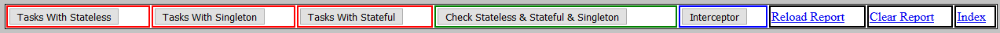 
<I>Screen from "Research Enterprise JavaBeans" page controls.</I>

<H3 id="e_j_b_tasks">EJB Example 'Tasks'</H3>

<OL>There are three batches (each having five tasks) launched with managed executor service:
  <LI>The batch with tasks using stateless session beans.</LI>
  <LI>The batch with tasks using singleton session beans.</LI>
  <LI>The batch with tasks using stateful session beans.</LI>
</OL>

Action: 
 
 Push button "Tasks With Stateless" three times. 

<OL>Results:
  <LI>It is evident that the bean stateless state (the value of the bean field) as a rule is not preserved.</LI>
  <LI>All five (injected with @EJB) stateless beans reference the same proxy object (hash codes are equal).</LI>
  <LI>All five stateless bean instances, used in launched tasks, were different objects (hash codes are not equal).</LI>
</OL>

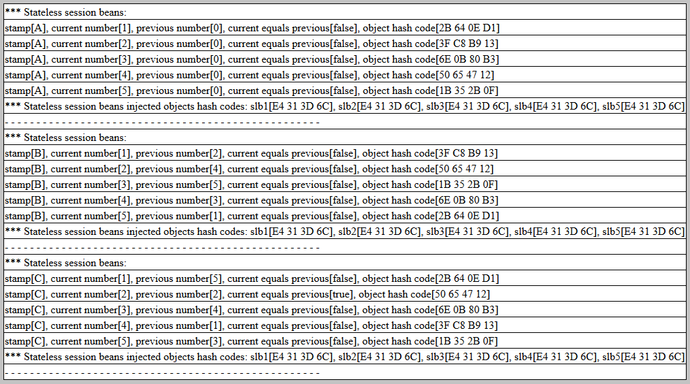 
<I>Screen from three 'Tasks With Stateless' actions.</I>

Action: 
 
 Push button "Tasks With Singleton" three times. 

<OL>Results:
  <LI>From the bean hash code it is evident that the singleton bean state (the value of the bean field) is always overwritten.</LI>
  <LI>All five (injected with @EJB) singleton beans reference the same proxy object (hash codes are equal).</LI>
  <LI>All five singleton bean instances, used in launched tasks, were the same object (hash codes are equal).</LI>
</OL>

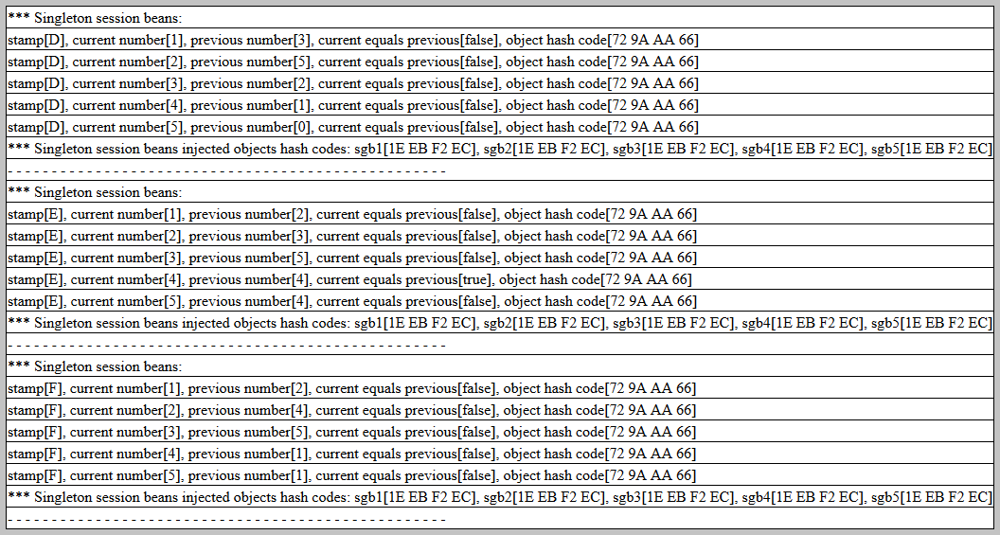 
<I>Screen from three 'Tasks With Singleton' actions.</I>

Action: 
 
 Push button "Tasks With Stateful" three times. 

<OL>Results:
  <LI>The bean state (the value of the bean field) is always preserved.</LI>
  <LI>All five (injected with @EJB) stateful beans reference different proxy objects (hash codes are not equal).</LI>
  <LI>All five stateful bean instances, used in launched tasks, were different objects (hash codes are not equal).</LI>
</OL>

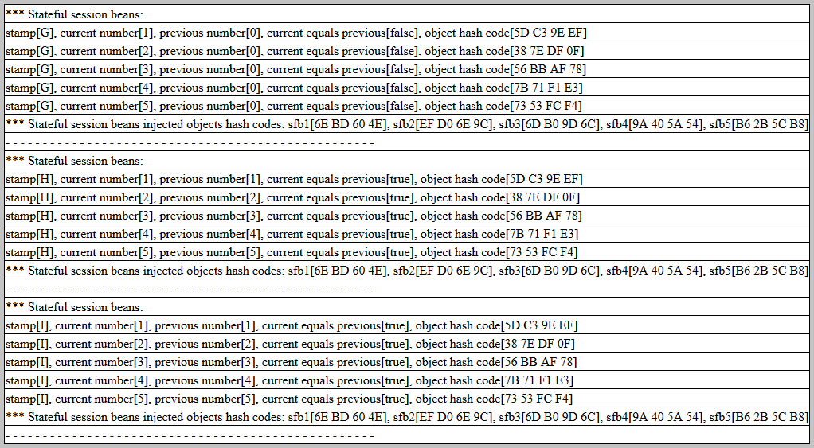 
<I>Screen from three 'Tasks With Stateful' actions.</I>

<H3 id="e_j_b_checks">EJB Example 'Checks'</H3>

Action: 
 
 Push button "Check Stateless &amp; Stateful &amp; Singleton". 

<OL>The bean instances invoked in this example:
  <LI>Local, no-interface view enterprise bean; injected with '@EJB' annotation; with class name 'NoIntViBean'.</LI>
  <LI>Local, stateless enterprise bean; injected with '@EJB' annotation; with class name 'StaLeLocalBean'.</LI>
  <LI>Remote, stateless enterprise bean; injected with '@EJB' annotation; with class name 'StaLeBean'.</LI>
  <LI>Remote, stateful enterprise bean; injected with '@EJB' annotation; with class name 'StaFuBean'.</LI>
  <LI>Remote, singleton enterprise bean; injected with '@EJB' annotation; with class name 'SingBean'.</LI>
  <LI>Local, no-interface view enterprise bean; injected with '@Inject' annotation; with class name 'NoIntViBean'.</LI>
  <LI>Local, stateless enterprise bean; injected with '@Inject' annotation; with class name 'StaLeLocalBean'.</LI>
</OL>

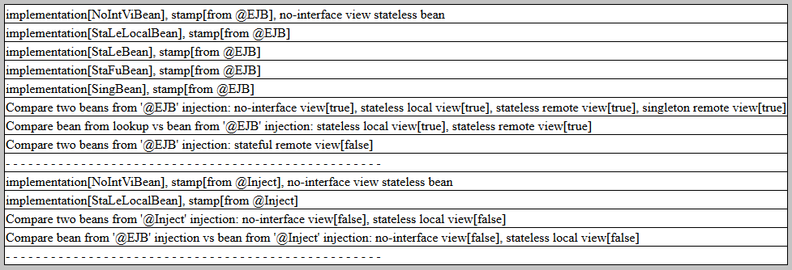 
<I>Screen from 'Check Stateless &amp; Stateful &amp; Singleton' action.</I>

<H3 id="e_j_b_interceptor">EJB Example 'Interceptor'</H3>

There were implemented the interceptors for the time elapsed capture.
<OL>In 'TimeElapsedBean' class the interceptors were added to those methods:
  <LI>'pausedMilli()' - this method stops for one millisecond.</LI>
  <LI>'pausedNano()' - this method stops for one nanosecond.</LI>
  <LI>'notPaused()' - this method is empty inside (has no body).</LI>
</OL>

Action: 
 
 Push button "Interceptor". 

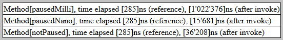 
<I>Screen from 'Interceptor' action.</I>

<H2 id="j_p_a">❷ Research Java Persistence API</H2>

Java source code: 
 
 package 
	<a href="https://github.com/ee-eng-cs/Study03/tree/master/ejb/src/main/java/kp/j_p_a/">kp.j_p_a</a>. 

Datasource 'Study03DS' uses H2 database with name 'study03' and in-memory mode. 
For CRUD actions there were used criteria queries. There is the switch in code to use named queries. 

Initial action: 
 
 Go to page <a href="http://localhost:8080/Study03/">http://localhost:8080/Study03/</a>
	and select "Research Java Persistence API". 

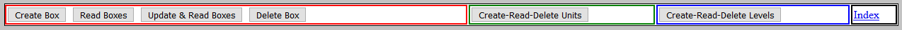 
<I>Screen from "Research Java Persistence API" page controls.</I>

<H3 id="j_p_a_boxes">JPA Example 'Boxes'</H3>
For 'Boxes' the JSF page uses 'BoxBean'. 

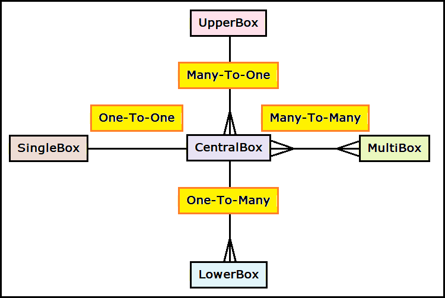 
<I>'Boxes' relationships diagram.</I>

Actions: 
 
 1. Push button "Create Box" four times. Only 3 calls were successful. 
The 4th call failed (it was the transaction rollback) because allowable creation maximum is 3 'CentralBox' objects. 
 2. Push button "Read Boxes". Report shows 3 'CentralBox' objects and its dependencies. 
 3. Push button "Update & Read Boxes". The 'CentralBox' field "cardinalDirection" was changed. 
 4. Push button "Delete Box" four times. 
The 4th call failed because there were no more 'CentralBox' objects left after three "Delete Box" calls. 

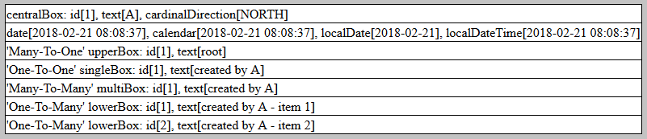 
<I>Screen from 1st 'Create Box' action.</I>

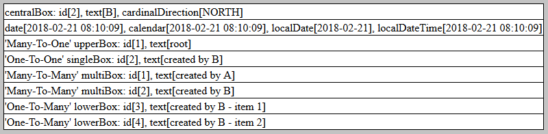 
<I>Screen from 2nd 'Create Box' action.</I>

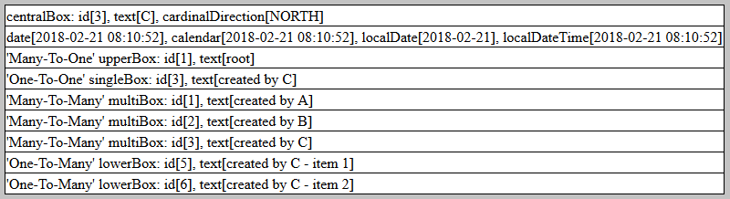 
<I>Screen from 3rd 'Create Box' action.</I>

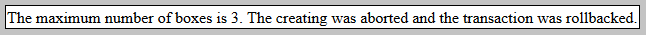 
<I>Screen from 4th 'Create Box' action.</I>

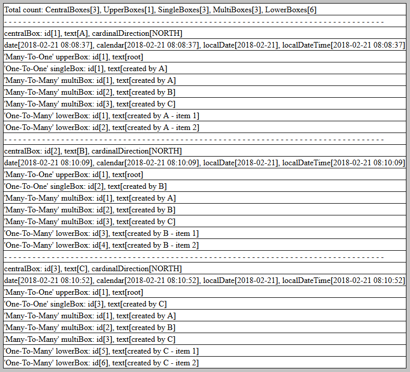 
<I>Screen from 'Read Boxes' action.</I>

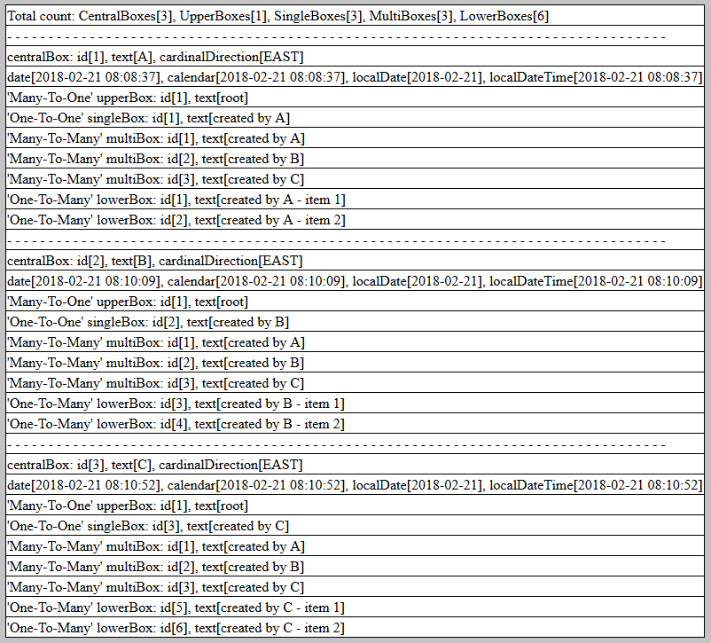 
<I>Screen from 'Update &amp; Read Boxes' action.</I>

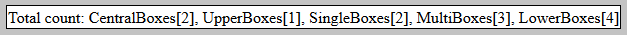 
<I>Screen from 1st 'Delete Boxes' action.</I>

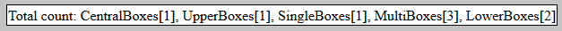 
<I>Screen from 2nd 'Delete Boxes' action.</I>

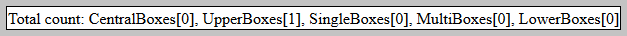 
<I>Screen from 3rd 'Delete Boxes' action.</I>

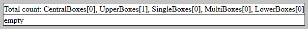 
<I>Screen from 4th 'Delete Boxes' action.</I>

<H3 id="j_p_a_units">JPA Example 'Units'</H3>
For 'Units' the JSF page uses 'UnitManagedBean'. For CRUD actions there were used criteria queries. 

The 'Units' have relationships:
<UL>
	<LI><I>One-To-One</I> self-referential relationship between 'previous' and 'next'</LI>
	<LI><I>Many-To-One</I> self-referential relationship between 'parent' and 'children'</LI>
	<LI><I>One-To-Many</I> relationship between 'Unit' object and 4 'Side' objects using enumeration 'CardinalDirection'</LI>
</UL>

	

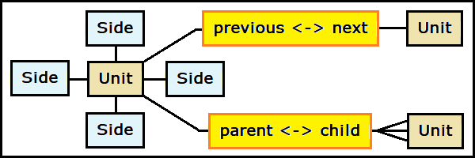 
<I>Units relationships diagram.</I>

Actions: 
 
 1. Push button "Create-Read-Delete Units" the 1st time. 
The 'Units' were created and persisted to database. 
 2. Push button "Create-Read-Delete Units" the 2nd time. 
In that request the 'Units' were read from database, presented as a report and removed from database. 

The presented report shows the results of the query. 
For 3 'Units' there is <I>previous - next</I> relationship : A -> B -> C. 
For 4 'Units' there is <I>parent - children</I> relationship: C -> (X, Y, Z). 
For all 6 'Units' and 24 'Sides' there is <I>one-to-many</I> relationship: 
every 'Unit' object has four unique 'Side' objects.

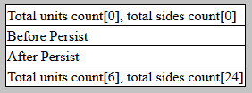 
<I>Screen from 1st 'Create-Read-Delete Units' action</I>

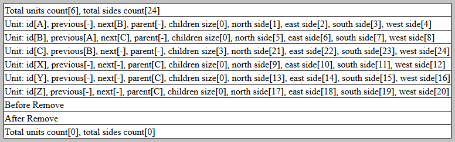 
<I>Screen from 2nd 'Create-Read-Delete Units' action</I>

<H3 id="j_p_a_levels">JPA Example 'Levels'</H3>
For 'Levels' the JSF page uses 'LevelManagedBean'. For CRUD actions there were used criteria queries with metamodel.

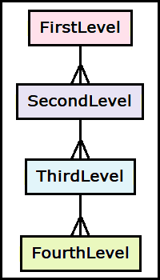 
<I>'Levels' relationships diagram. It is the 'One-To-Many' hierarchical relationships.</I>

Actions: 
 
 1. Push button "Create-Read-Delete Levels" the 1st time. 
The 'Levels' were created and persisted to database. 
 2. Push button "Create-Read-Delete Levels" the 2nd time. 
In that request the 'Levels' were read from database, presented as a report and removed from database. 

The presented report shows the results of four queries. 
1st query using string with pattern "<B>SELECT ... FROM ... JOIN ... WHERE ... IN ...</B>". 
2nd query using string with pattern "<B>SELECT ... FROM ... IN   ... WHERE ... IN ...</B>". 
3rd query using criteria with '<B>join</B>'. 
4th query is the aggregate function query using criteria with '<B>groupBy</B>'.

For the 1st, 2nd and 3rd query the result is identical. 
The result of the 4th query is the intersection of the '<B>having</B>' restriction and the '<B>where</B>' restriction.

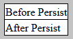 
<I>Screen from 1st 'Create-Read-Delete Levels' action</I>

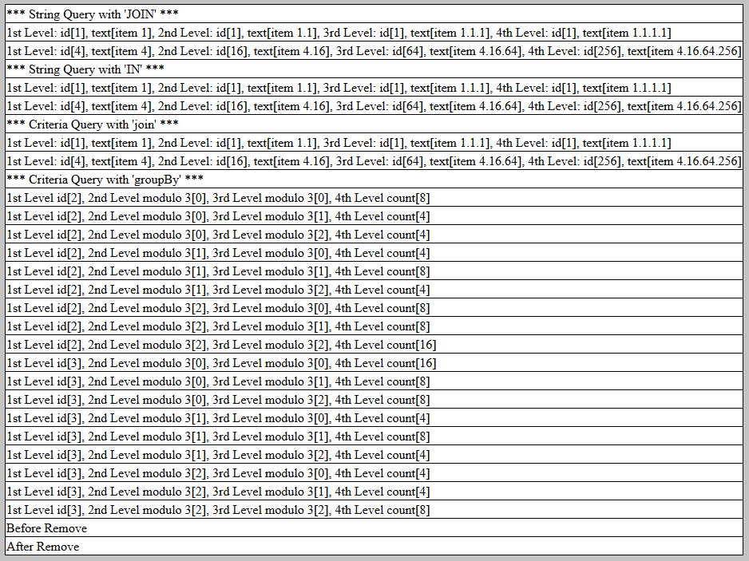 
<I>Screen from 2nd 'Create-Read-Delete Levels' action</I>

<H2 id="j_m_s">❸ Research Java Message Service</H2>

Java source code: 
 
 package 
	<a href="https://github.com/ee-eng-cs/Study03/tree/master/ejb/src/main/java/kp/j_m_s/">kp.j_m_s</a>. 

For JBoss JMS configuration is used batch file "06 CLI Config Queue & Topic.bat".

Initial actions: 
 
 1. Go to page <a href="http://localhost:8080/Study03/">http://localhost:8080/Study03/</a>
	and select "Research Java Message Service". 
 2. Open 2nd browser tab with link "Open Page in New Browser Tab". 

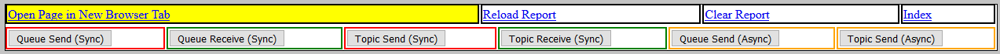 
<I>Screen from "Research Java Message Service" page controls.</I>

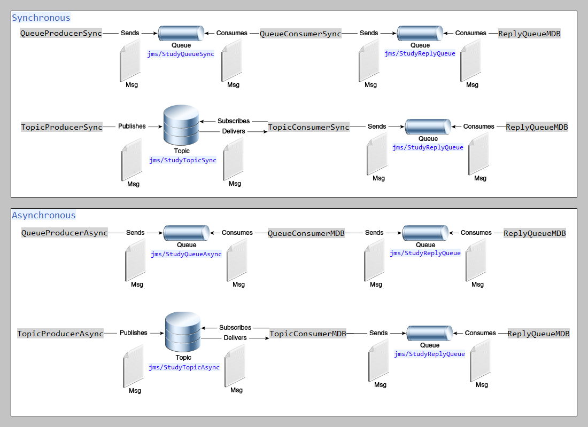 
<I>Queues &amp; topics diagram.</I>

<H3 id="j_m_s_sync">JMS Example 'Synchronous Queue &amp; Topic'</H3>

Actions: 
 
 1. <I>(synchronous queue)</I> In the 2nd tab push button "Queue Receive (Sync)". 
 2. <I>(synchronous queue)</I> In the 1st tab push button "Queue Send (Sync)". 
 3. <I>(synchronous topic)</I> In the 2nd tab push button "Topic Receive (Sync)". 
 4. <I>(synchronous topic)</I> In the 1st tab push button "Topic Send (Sync)". 
 5. In the 1st tab click link "Reload Report". 

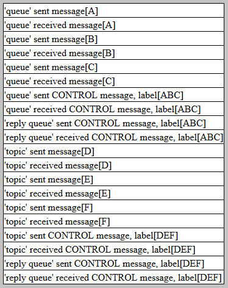 
<I>Screen from synchronous queue &amp; topic send/receive actions.</I>

<H3 id="j_m_s_async">JMS Example 'Asynchronous Queue &amp; Topic'</H3>

Actions: 
 
 1. <I>(asynchronous queue)</I> In the 1st tab push button "Queue Send (Async)". 
 2. <I>(asynchronous topic)</I> In the 1st tab push button "Topic Send (Async)". 
 3. In the 1st tab click link "Reload Report". 

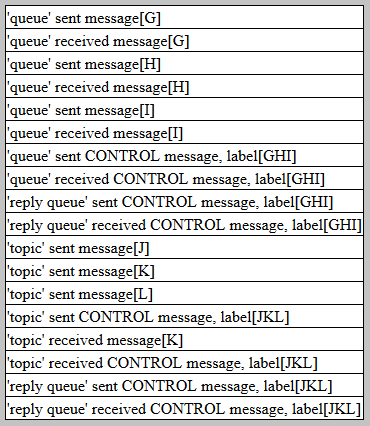 
<I>Screen from asynchronous queue &amp; topic send/receive actions.</I>

<H3>Other JMS test scenarios</H3>
<OL>"First send then receive" test scenario for synchronous queue:
	<LI>Send to queue.</LI>
	<LI>Restart server.</LI>
	<LI>Receive from queue.</LI>
	<LI>Result: messages were <B>not lost</B>.</LI>
</OL>
<OL>"First send then receive" test scenario for synchronous topic:
	<LI>Send to topic.</LI>
	<LI>Receive from topic.</LI>
	<LI>Because receiver waits for messages (page hangs), repeat the sending to topic.</LI>
	<LI>Result: messages sent in the 1st action were <B>lost</B>.</LI>
</OL>
<OL>"Two consumers" test scenario for synchronous queue:
	<LI>Open the 2nd & the 3rd tab.</LI>
	<LI>In the 2nd tab push button "Queue Receive (Sync)".</LI>
	<LI>In the 3rd tab push button "Queue Receive (Sync)".</LI>
	<LI>In the 1st tab push button "Queue Send (Sync)" <B>two times</B> and click link "Reload Report".</LI>
	<LI>Result: for two consumers two queues were used because this is the point-to-point messaging.</LI>
</OL>
<OL>"Two subscribers" test scenario for synchronous topic:
	<LI>open the 2nd & the 3rd tab.</LI>
	<LI>In the 2nd tab push button "Topic Receive (Sync)".</LI>
	<LI>In the 3rd tab push button "Topic Receive (Sync)".</LI>
	<LI>In the 1st tab push button "Queue Send (Sync)" <B>one time</B> and click link "Reload Report".</LI>
	<LI>Result: for two subscribers single topic was used because this is the publish/subscribe messaging.</LI>
</OL>

<H2 id="trans_c_m_t">❹ Research Container-Managed Transactions</H2>

Java source code: 
 
 package 
	<a href="https://github.com/ee-eng-cs/Study03/tree/master/ejb/src/main/java/kp/trans_c_m_t/">kp.trans_c_m_t</a>. 

Initial action: 
 
 Go to page <a href="http://localhost:8080/Study03/">http://localhost:8080/Study03/</a>
	and select "Research Container-Managed Transactions". 

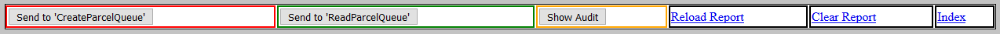 
<I>Screen from "Research Container-Managed Transactions" page controls.</I>

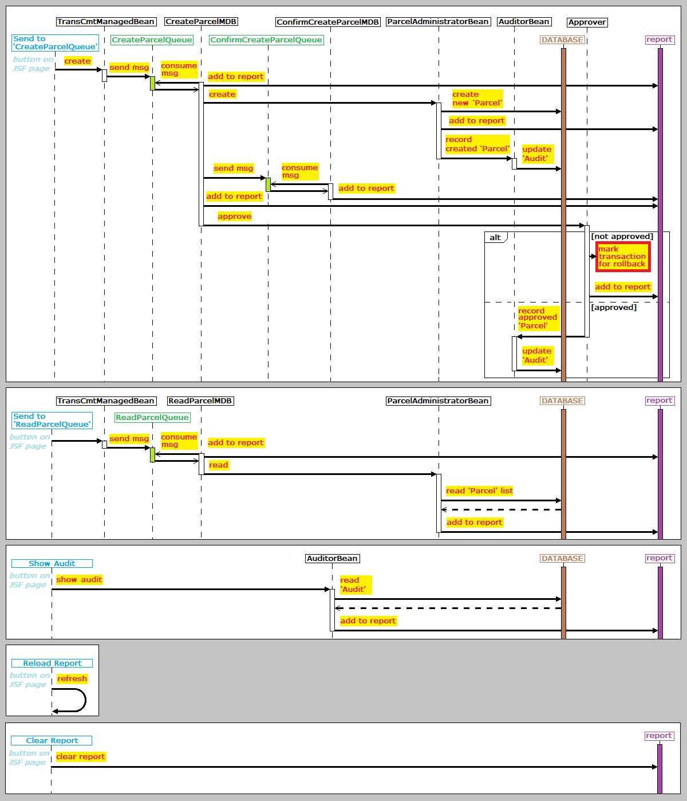 
<I>Research CMT sequence diagram.</I>

It was implemented 'Parcel' approving logic. It validates every new created 'Parcel' object. 
The 'Parcel' with odd id value (1, 3, 5, ...) is not approved and transaction is marked for rollback. 
The 'Parcel' with even id value (2, 4, 6, ...) is approved.

Action: 
 
 1. Push button "Send to 'CreateParcelQueue'" three times and button "Reload Report". 

<OL>
	<LI>The message from the 'CreateParcelQueue' is consumed and a new 'Parcel' is created.</LI>
	<LI>The confirmation message is send to the 'ConfirmCreateParcelQueue'.</LI>
	<LI>The created 'Parcel' has odd id value and is not approved.</LI>
	<LI>Therefore the transaction is marked for rollback.</LI>
	<LI>The message is <B>redelivered</B> to the 'CreateParcelQueue' and from this message a new 'Parcel' is created.</LI>
	<LI>The confirmation message is send to the 'ConfirmCreateParcelQueue'.</LI>
	<LI>The created 'Parcel' has even id value and is approved.</LI>
	<LI>From the 'ConfirmCreateParcelQueue' is consumed only the 2nd confirmation message.</LI>
</OL>

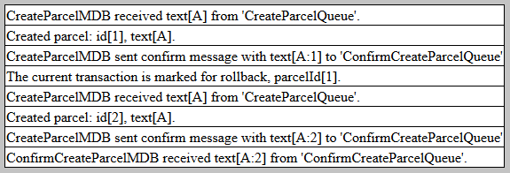 
<I>Screen from 1st "Send to 'CreateParcelQueue'" action</I>

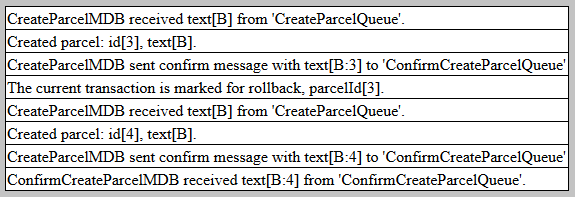 
<I>Screen from 2nd "Send to 'CreateParcelQueue'" action</I>

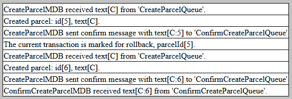 
<I>Screen from 3rd "Send to 'CreateParcelQueue'" action</I>

Action: 
 
 Push button "Send to 'ReadParcelQueue'" and button "Reload Report". 

All committed 'Parcel' objects in the database have even id values. 
This proves that all not approved 'Parcel' objects were rolled back.

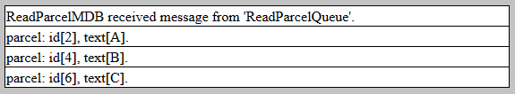 
<I>Screen from "Send to 'ReadParcelQueue'" action</I>.

Action: 
 
 Push button "Show Audit" and button "Reload Report". 

Auditing is always processed in a new transaction. 
Therefore the audit information was not lost when the main transaction was rolled back.

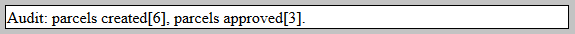 
<I>Screen from "Show Audit" action</I>

<H2 id="trans_b_m_t">❺ Research Bean-Managed Transactions</H2>

Java source code: 
 
 package 
	<a href="https://github.com/ee-eng-cs/Study03/tree/master/ejb/src/main/java/kp/trans_b_m_t/">kp.trans_b_m_t</a>. 

<I>
In a stateless session bean with bean-managed transactions, 
a business method must commit or roll back a transaction before returning. 
However, a stateful session bean does not have this restriction. 
In a stateful session bean with a JTA transaction, 
the association between the bean instance and the transaction is retained across multiple client calls. 
Even if each business method called by the client opens and closes the database connection, 
the association is retained until the instance completes the transaction.
</I>

Initial action: 
 
 Go to page <a href="http://localhost:8080/Study03/">http://localhost:8080/Study03/</a>
	and select "Research Bean-Managed Transactions". 

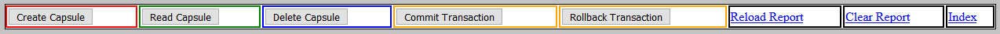 
<I>Screen from "Research Bean-Managed Transactions" page controls.</I>

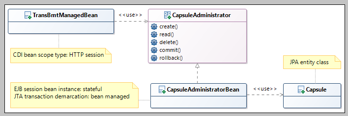 
<I>Research BMT class diagram.</I>

Actions: 
 
 1. Push button "Create Capsule" two times, button "Commit Transaction" and button "Read Capsule". 
 2. Push button "Create Capsule" and button "Read Capsule". 
This step has created not committed 'Capsule' object. 
 3. Push button "Rollback Transaction" and button "Read Capsule". 
It was rolled back to the last commit (point 1. above). 
 4. Push button "Delete Capsule" and button "Read Capsule". 
The "Delete Capsule" action deletes last created 'Capsule' 
 5. Push button "Rollback Transaction" and button "Read Capsule". 
Again, it was rolled back to the last commit (point 1. above). 

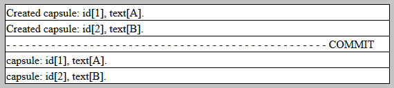 
<I>Screen from  actions: 1st "Create Capsule", 2nd "Create Capsule", "Commit Transaction", "Read Capsule"</I>

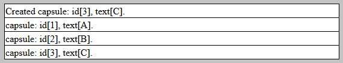 
<I>Screen from  actions: 3rd "Create Capsule", "Read Capsule"</I>

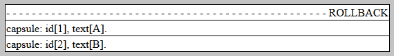 
<I>Screen from  actions: 1st "Rollback Transaction", "Read Capsule"</I>

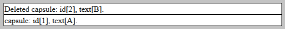 
<I>Screen from  actions: "Delete Capsule", "Read Capsule"</I>

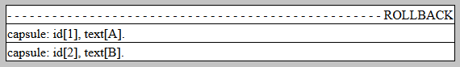 
<I>Screen from  actions: 2nd "Rollback Transaction", "Read Capsule"</I>

<A href="apidocs/index.html" >API Specifications</A>
(API was not commited to <B>GitHub</B>; this link should be active after local build with <I>'mvn javadoc'</I>)

</BODY>
</HTML>